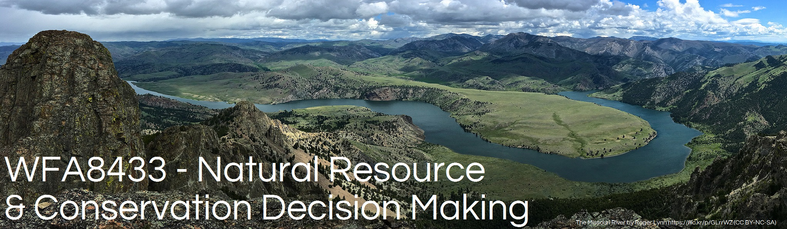

<!--
library(knitr)
rmarkdown::render_site("Class-04.Rmd")# build website

# rmarkdown::render_site()# build webpage
# COPY FILES TO DOCS FOR GITHUB.IO
system(paste("xcopy", 
    '"C:/Users/mcolvin/Documents/Teaching/WFA8433-Natural-Resource-Decision-Making/Course-Materials/_site"', 
    '"C:/Users/mcolvin/Documents/Teaching/WFA8433-Natural-Resource-Decision-Making//Docs"',
    "/E /C /H /R /K /O /Y")) 
  q(save="no") 
-->


```{r echo=FALSE, out.width="95%"}

```

# Class 4: Decision tress and networks

<!--
Hammond et al.: Chapters(s) 7-9
Assign students to groups
-->
 
* Supplemental background reading for next class(es):
    * Smart choices: 7-9
* Assignment due: None
* 
* Link to class deck [PDF](/pdfs/class-04.pdf)

