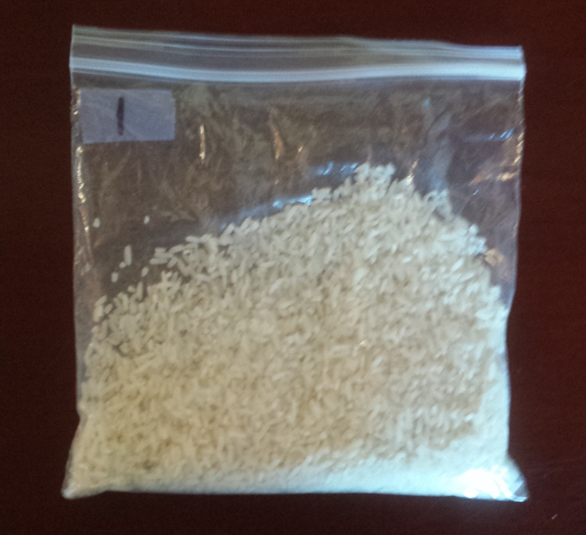

 <!--

library(knitr)
rmarkdown::render_site("Class-15.Rmd")# build website
# rmarkdown::render_site()# build webpage
# COPY FILES TO DOCS FOR GITHUB.IO
system(paste("xcopy",'"C:/Users/mcolvin/Documents/Teaching/WFA8433-Natural-Resource-Decision-Making/Course-Materials/_site"',     '"C:/Users/mcolvin/Documents/Teaching/WFA8433-Natural-Resource-Decision-Making/Docs"',     "/E /C /H /R /K /O /Y")) 
q(save="no") 

rmarkdown::render_site()# build webpage
## PURL R CODE FROM CLASS NOTES
p<- knitr::purl("Class-15.Rmd")
knitr::read_chunk(p)
chunks <- knitr:::knit_code$get()
chunkss<- lapply(1:length(chunks),function(x){if(!(names(chunks[x]) %in% c("echo=FALSE" ,"eval=FALSE"))){c(paste0("## ----", names(chunks)[x] ,"---- ##"),chunks[[x]]," "," "," ")}})
xxx<- unlist(chunkss);
writeLines(xxx,"./scripts/Class-15.R")
system(paste("xcopy",'"C:/Users/mcolvin/Documents/Teaching/WFA8433-Natural-Resource-Decision-Making/Course-Materials/_site"',     '"C:/Users/mcolvin/Documents/Teaching/WFA8433-Natural-Resource-Decision-Making/Docs"',     "/E /C /H /R /K /O /Y")) 

-->


```{r echo=FALSE, out.width="100%"}

rm(list=objects())
class<-"Class-15"
```
<!--
Homework 1:  Introduction to basic computing- R
List of preliminary problems to instructor for review
-->

# Finishing HLMs & estimating occupancy {-}

# Class 15 preliminaries

## Housekeeping
* Dr. Mark Woodrey
    * Guest speaker-last 10 minutes of class
    * Application of Structured Decision Making to the 
    Development of a Gulf of Mexico-wide Bird Monitoring Program  March
    10th at 11 am. Tully Auditorium.
* Supplemental background reading(s):
    * Powell and Gale. Chapter 15: Occupancy Modeling [here](http://media.wix.com/ugd/95e73b_431c4d6ee6c6475d909dc90a766ae185.pdf)
    * Welsh, A. H., D. B. Lindenmayer, and C. F. Donnelly. 2013. Fitting and Interpreting Occupancy Models. Plos One 8:e52015.[pdfs/W202.pdf]
    * Guillera-Arroita, G., J. J. Lahoz-Monfort, D. I. MacKenzie, B. A. Wintle, and M. A. McCarthy. 2014. Ignoring Imperfect Detection in Biological Surveys Is Dangerous: A Response to 'Fitting and Interpreting Occupancy Models'. Plos One 9:e99571.[pdfs/G140.pdf]
    * Welsh, A. H., D. B. Lindenmayer, and C. F. Donnelly. 2015. Adjusting for One Issue while Ignoring Others Can Make Things Worse. Plos One 10:e0120817. [pdfs/W203.pdf]
* Assignment due: None
* Class project: Think about decision model (objectives, nodes, utilities)
* Link to class recording  [YouTube](https://youtu.be/dQcjHnEuNKY)
* Today's R script [Class-15.R](scripts/Class-15.R)

## Class overview & objectives 

This will be the last class the deals with predicting an outcome
as a result of some inputs using a general or generalized linear model.

By the end of this class you should be able to:

1. Account for hierarchical dependence in linear model
1. Use upper level predictors in a hierarchical linear
model.


## Preliminaries

* The R scipt for class can be found [here](scripts/Class-15.R)
* Once you have the script where you want it it where you want open the 
R script and be sure to check the working directory `getwd()` and make 
sure it is where your folder is. 
* If your working directory is not correct, you can set it in Rstudio: 
"Session --> Set Working Directory --> To source file location". Or you 
can use the `setwd()` in the console. 

# HLMs continued

## Random intercept and slopes

Another instance we commonly run into is where we may have random 
intercepts and slopes. In other words we have heterogeneous intercepts 
and slopes. What does that remind you of? Well if you were thinking an 
about an interaction then, winner winner chicken dinner. However when we 
have many groups the number of parameters we estimate can quickly become 
numerous if we treat them as fixed effects. Additionally, it precludes 
us from making predictions beyond the groups in the model. However, 
random effects clears that up. 

Let's get some data rolling for a model that formally looks like this:

$$\mu_{i,j} = \beta_{0,j} + \beta_{1,j} \cdot X $$

and 

$$\beta_{0,j} = \gamma + \epsilon$$ where

and 

$$\beta_{1,j} = \delta + \tau$$ 

where

$$ \epsilon \sim Normal (0, \sigma_{\beta{0}})$$,  

$$ \tau \sim Normal (0, \sigma_{\beta{1}})$$, and 

$$Y_{i,j}\sim Normal(\mu_{i,j},\sigma)$$.

The parameters in the equations above are: 

Fixed effects:

* $\beta_{0,j}$ is the group specific intercept
* $\beta_{1,j}$ is the group specific effect of $X$ 
* $\gamma$ is population mean intercept
* $\delta$ is the population mean slope

Random effects:

* $\sigma_{\beta{0}}$ is the standard deviation of group specific intercepts
* $\sigma_{\beta{1}}$ is the standard deviation of group specific slopes
* $\sigma$ is the standard deviation of the residuals

Whoziers, 3 random effects, pulling a hat trick. 

Data and predictions:

* $\mu_{i,j}$$ the expected outcome
* $Y_{i,j}$ is the observed data

Indexes:

* $i$ indexes observations
* $j$ indexes groups


Let's get this party started and build on our last dataset to
get this beast rolling.  

The code is the same as the heterogeneous intercept model.

Step 1 generate $\beta_0$ and $\beta_1$ and random effects.
```{r}
set.seed(8675309)

ngroups=50
beta0<- 10
beta0<- beta0+rnorm(ngroups,0,20) # random effect of group

beta1<- 0.95
beta1<- beta1+rnorm(ngroups,0,1.3) # random effect of group
```
Now we can put them in a dataset to calculate predictions.

```{r}
dat<- data.frame(
    beta0 = rep(beta0,30), 
    beta1= rep(beta1, 30), 
	group=rep(c(1:ngroups),30),
    x=runif(ngroups*30,10,50))
dat$group<- as.factor(dat$group)
```

And make our baseline predicted outcomes.

```{r}
dat$obs<- dat$beta0+ dat$beta1*dat$x
```
Ok now let's gin up some random effects, 50*30 to be exact, one
for each observation and add them to our baseline predicted outcomes.
The $\sigma$ for this random effect is equal to 1.

```{r}
dat$obs<- rnorm(ngroups*30,dat$obs,50)
```  

Just like the intercepts only but now we have a random effect 
around $\beta_1$.

```{r}
library(lattice) # need for xypot
xyplot(obs~x,
    data=dat,
    group=group)
```

That data looks good but messy! But thats where this gets fun.
Uncertainty galore, uncertain outcomes, what is a decision 
maker to do but be in for a world of hurt? Nah, we can fit the 
model we described above.

```{r}
library(lme4)
fit<- lmer(obs~x + (1+x|group), dat)
summary(fit)
```

Our estimates of the random effects are legit close to the values
we fed the simulated data. And the fixed effects are close!

But what does it all mean? Well there is lots of 
uncertainty as we saw in the plot some groups go 
up some go down which makes for a difficult time of 
predicting outcomes with any certainty. 

What if we could predict the random effects using 
a group level variable? Yes, Yes you can...


## Predicting random effects

Here we have a dataset with heterogeneous intercepts but for
simplicity the the slopes will be homogeneous. This type of 
data might arise with hierarchically structured data, which I 
commonly encounter in streams.  Specifically streams are nested 
within watershed.  Suppose in this case we have a response variable
where we have multiple observations within a watershed and there are
35 watersheds with data. The catchment size of the watershed vary
and can be used to predict the intercept of watershed specific 
intercepts. Formally we are looking at a model defined as:


$$\mu_{i,j} = \beta_{0,j} + \beta_{1} \cdot X $$

and 

$$\beta_{0,j} = \gamma + \nu \cdot \text{Catchment Size} + \epsilon$$ 

where

$$ \epsilon \sim Normal (0, \sigma_{\beta{0}})$$

and 

$$Y_{i,j}\sim Normal(\mu_{i,j},\sigma)$$

The key is in the middle where we are now predicting $\beta_{0,j}$ 
using a linear model!  

Ok let's simulate a dataset to verify our understanding.

```{r}
nwatersheds<- 35

# A WATERSHED LEVEL COVARIATE
catchmentSize<- c(213,91,326,30,267,
    216,178,167,251,261,139,400,399,  
    56,261,34,90,108,224,312,85,64,
    254,188,266,95,391,327,351,314,
    211,305,170,273,253)
```

Now lets specify $\gamma$ and $\nu$ for the wateshed level equation.

```{r}
beta0_ws<- 5
beta1_ws<- 0.8
```
Now we can add the random effect ($\epsilon$ to the intercept
where the random effect is normally distributed with mean 0 and
a standard deviation of 55.

```{r}
beta0<- beta0_ws +beta1_ws*catchmentSize + rnorm(nwatersheds,0,55)
```
Let's see what the intercepts look like.

```{r}
plot(catchmentSize,beta0,
    xlab="Catchment size",
    ylab="Intercept value")
```

Suppose there are 80 sites within each watershed.
We can cobble together the predictors now.

```{r}
withinsites<- 80
dat<- data.frame(
    beta0 = rep(beta0,withinsites), 
    beta1= -3.6, 
	group=rep(c(1:nwatersheds),withinsites),
	catchmentSize=rep(catchmentSize,withinsites),
    x=runif(nwatersheds*withinsites,10,50))
dat$group<- as.factor(dat$group)
```

And generate the predictions
```{r}
dat$y<- dat$beta0 + dat$beta1*dat$x
```
and layer on the last bit of uncertainty

```{r}
dat$obs<- rnorm(nrow(dat),dat$y,15)
```
Let's look at the mess we created. 

```{r}
xyplot(obs~x,
    data=dat,
    xlab="Catchment size",
    ylab="Intercept value",
    group=group)
```
Now we can use the `lmer()` to fit the model. The 
key here is that we include `catchmentSize` as a predictor
in the model and because we specified heterogeneous intercepts 
and the catchment values are structured by group it ends up 
predicting $\nu$.

```{r}
fit<- lmer(obs~x+ catchmentSize + (1|group) , dat)
summary(fit)
```
Oh boy, it worked.

```{r}
fixef(fit)
```
Those are pretty close to the values we used!

The intercept is a bit off, but what do you expect we put a big
chunk of uncertainty around it, $\sigma$=55 as I recall.


# Estimating Current States-Occupancy

## Background

Suppose you are out in the field at a specific location (note-occupancy 
makes inference about the site being occupied or not) and you repeated 
sample that site for a critter. It is likely you do not perfectly detect 
that critter if it is there, but you can detect it with some 
probability. Lets assume you can perfectly detect the critter then the 
detection history would be 1111 if you went out on 4 occasions. If you 
have imperfect detection, let's define detection probability as $p$, 
then there is some probability you might miss detecting the critter even 
if it is there. Now that brings up a the foundation of occupancy 
analysis, you can miss a critter for 2 reasons: 1) that critter was not 
there to begin with (i.e., was not occupying the site) or 2) the critter 
was there (i.e., was occupying the site) but you did not detect it. 
These 2 sources of 0s in a detection history can either be a true 
negative (reason 1 above) or a false negative (reason 2 above). 

## Probability of a site being occupied

In this context, occupancy as we observe it, is a 0 or 1. However as we 
think about occupancy or try to model occupancy it is done as a 
probability. Lets define the probability of a site being occupied as 
$\psi$. Let's assume that we can detect our critter perfectly and $p = 
1$. Now, if we have a $\psi = 0.35$, the probability of site not being 
occupied is $1=\psi$ or 1-0.35 = 0.65. Recall that occupancy is site or 
habitat specific and therefore the true site occupancy status (0 or 1) 
and therefore occupancy for 10 sites might be 111000000 for 10 sites 
given a $\psi = 0.35$. We can actually simulate this easily in r. 
Suppose there are potential 3000 sites to sample in a large tract of 
land (i.e., the sampling domain). But we can only sample 35 of those 
sites due to budget limitations. Lets simulate this to see how things 
play out 


## Corn in a rice field

The graphic below illustrates a situation where it may be hard
to detect an occurrence. Specifically there is a popcorn kernel
in the bag of rice. We will work through an exercise to generate some data
and estimate occupancy.

```{r echo=FALSE, out.width="50%", fig.align="center"}

```
 
```{r}
#install.packages("unmarked")
library(unmarked)
```
Now we need to get our detections into a matrix for unmarked.
In this example we don't have any covariates so the 
`siteCovs` and the `obsCovs` are set to `NULL`.
 
```{r}
#detections<- matrix(c(),nrow=6, ncol=???)
#detections<-  unmarkedFrameOccu(detections, siteCovs=NULL, obsCovs=NULL)
#detections
```
Now we can use the `occu()` function to estimate occupancy

```{r}
#fit <- occu(~ 1 ~ 1, detections)
#fit
#backTransform(fit, type="state")
#backTransform(fit, type="det")
```
