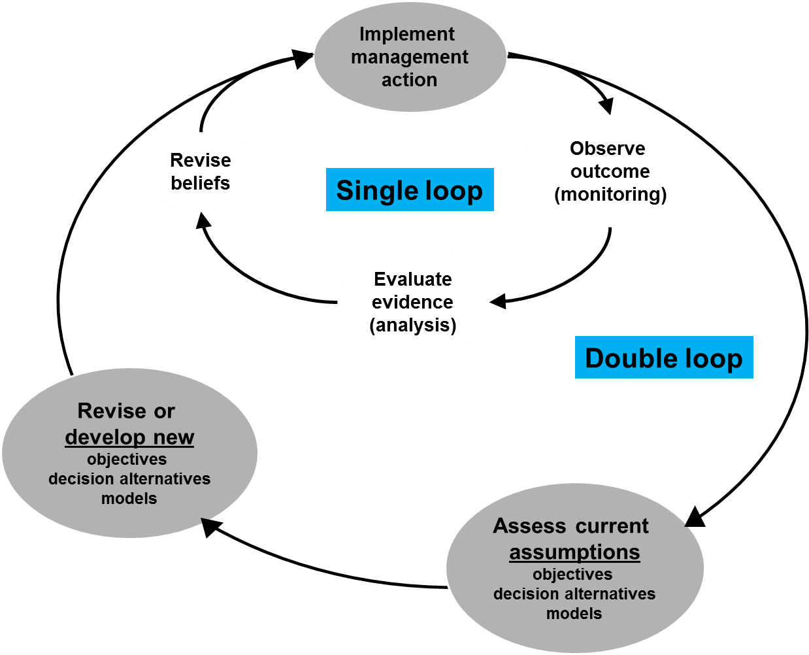

 <!--


rmarkdown::render_site("Class-22.Rmd")# build website
library(knitr)
rmarkdown::render_site()# build website

source("_build.R")
build("Class-22",bld="PAGE",docs=TRUE) # bld = PAGE,ENTIRE,SCRIPT

# PURL THIS SHIT & MOVE FILES TO DOCS
build("Class-22",bld="SCRIPT",docs=TRUE) # bld = PAGE,ENTIRE,SCRIPT

source("_build.R");build("Class-22",bld="PAGE",docs=TRUE)# bld = PAGE,ENTIRE,SCRIPT

-->


```{r echo=FALSE, out.width="100%"}
library(knitr)

```


# Class 22: Monitoring, Information, and ARM Continued {-}

# Class preliminaries

* Supplemental background reading for next class(es):
<!--
********** add some reading
-->
* Reading(s) for next time:
    * Conroy and Peterson Chapter 7
    * Conroy and Peterson Chapter 9
* Class project: 
    * Be developing your decision model
    * Final exam period-April 28th at 3pm.
* Link to class recording  [YouTube]()
* Today's R script [Class-22.R](scripts/Class-22.R)

## Class overview & objectives 

The objectives of this class are to:

1. Further understanding of Bayes Theorem
2. Formally use monitoring to learn
3. Adapting decisions to learning in adaptive management


# Conditional probability

The core of Bayesian inference and Bayes approaches to updating 
information is Bayes' Theorem. To understand Bayes' Theorem (BT) we 
first have to understand what a conditional probability is. A 
conditional probability (or distribution) is simply the probability of 
an event $y$ given that some other event $x$ occurs. 

As a simple example, $y$ could be the event of drawing a spade from a 
deck and $x$ is the event of drawing a heart. Either of these 
events can occur by themselves with probability $p(y=Spade)$, 
$p(x=Heart)$ respectively with $p=1/4$ each in this case. 


```{r}
deck<- expand.grid(
    suit = c("Diamond", "Club", "Heart", "Spade"),
    card = c("Ace", "Deuce", "Three", "Four","Five", 
             "Six", "Seven", "Eight", "Nine", "Ten", 
             "Jack", "Queen", "King"))
deck$id<-1:nrow(deck) # for sampling later
ncards<-nrow(deck)
prX<- nrow(deck[deck$suit=="Heart",])/ncards #p(x=Heart)
prY<-  nrow(deck[deck$suit=="Spade",])/ncards #p(x=Spade) 
```

Let's confirm that the probability of drawing a Heart is in fact 0.25 and drawing
a Spade is 0.25.

```{r}
prX
prY
```
Good, these numbers jive. 

Now what if we were curious what the probability of the drawing a Heart 
or a Spade? This is a joint probability and it specifies the probability 
of outcome $y$ or $x$ occurring. The rule for joint probabilities 
specifies that the probability of the events $y$ and $x$ jointly 
occurring is: 


$$P(y \cap x) = p(y | x) p(x)$$


where $p(y | x)$ is the conditional probability of outcome $y$ given 
outcome $x$. For example, $p(y | x)$ might be the probability of drawing 
a Spade if a Heart has already been drawn (and not replaced in the deck, 
in this case, $P(y | x) = 13/51$. Thus, the joint probability of drawing 
a spade given a heart was drawn is 


$$P(y \bigcap x) = p(y | x) p(x) = 0.064 = \frac{13}{51}\cdot \frac{1}{4}.$$

Let's confirm this by simulation.

```{r}
reps<-50000
indx<-sample(nrow(deck),reps,replace=TRUE) # index for card selected
out<-data.frame(firstCardSuit=deck[indx,]$suit)
prop.table(table(out)) # all close to 0.25
```

Now we need to simulate the second part of the process where 
we select a card given one card has been removed.


```{r}
out$secondCardSuite<-NA
# SIMULATE THE PROCESS
for(i in 1:reps)
    {
    # SAMPLE ANOTHER CARD AND GET THE SUITE
    id<- sample(deck$id[-indx[i]],1)
    out$secondCardSuit[i]<- as.character(deck$suit[id])
    }
```


```{r}
out$tmp<-1
outcomes<-aggregate(tmp~firstCardSuit+secondCardSuit,out,FUN=sum)
outcomes$p<- outcomes$tmp/reps
```
Let's check and see if the probabilities for the first suit being a heart and
the second being a Spade is close to 0.064. 

```{r}
outcomes
```
Yes, they are pretty close, if you run for a large numbers of replicates they will
converge to 0.064. The key to Bayes rule is that the conditioning can go either way, so 


$$P(y \cap x) = p(y | x) p(x) = p(x | y) p(y)$$

Let's confirm with simulation again. Here are the outcomes formally

$$P(y \cap x) = p(y=Spade | x =Heart) p(x = Heart) $$ and

$$P(y \cap x) = p(x = Heart | y=Spade) p(y=Spade)$$


```{r}
nrow(out[out$firstCardSuit=="Heart" & out$secondCardSuit=="Spade",])/reps
nrow(out[out$firstCardSuit=="Spade" & out$secondCardSuit=="Heart",])/reps
```

The simulation shows this is true, within rounding error. is also true. 
BT follows by equating 2 expressions above


$$p(y | x ) p(x) = p(x | y) p(y)$$

Ok, so why are probabilities important? Good question, they are 
important because it is how we quantify our belief in something and the 
uncertainty in that belief. If we know something absolutely there is no 
uncertainty and the probability is 1. If we acknowledge our incomplete 
understanding, we need to put some value on our beliefs of how a system 
works and we have to have 2 or more explanations that are framed as 
hypotheses which in turn provide predictions that can be compared to 
monitoring. 

BT forms a general relationship between conditional and unconditional 
probabilities, and has many useful applications. One very useful role 
for BT is in helping us to update knowledge (e.g., about a parameter 
value) from information (like sample data). So if we let $\theta$ stand for 
the value of a parameter for example and x stand for sample data, we can 
re-write BT as 

$$p(\theta | x ) p(x) = p(x | \theta) p(\theta)$$

Viewed this way we have the following components:

* $p(\theta)$ expresses knowledge (uncertainty) about the parameter in 
the absence of (before collecting) data, and is also known as the prior 
* $p(\theta | x )$ expresses knowledge (uncertainty) about the parameter 
in the presence (after collecting) data, and is also known as the 
posterior. 
* $p(x | \theta)$ expresses the probability or likelihood of having 
obtained the data result, given a particular value of the parameter, and 
* $p(x)$ is the probability of the data (i.e., outcomes)

Let's put some sideboards on this flute music and see some application
make some sense of it. 


## Application of Bayesian Updating to Model Weights 

Above our focus has been on using data to update information about 
uncertainty in a parameter’s value. Another important application of 
BT is in updating our knowledge about which hypothesis or model is 
"true", when, as often is the case, our predictions and management 
decisions have to be based on more than 1 model. Now let $h_i$ stand for 
the event "Hypothesis i is true", while x still stands for the sample 
data, we can re-write BT as 


$$p(H_i | x)\cdot p(x) = p(x | H_i)\cdot p(H_i)$$


The above quantities now have the following interpretations:

* $p(H_i)$ expresses knowledge (uncertainty) about the truth of 
hypothesis i in the absence of (before collecting) data, and is also 
known as the prior probability that i H is true. 
* $p(x)$ expresses the probability of the data,
* $p(H_i | x)$ expresses knowledge (uncertainty) about the truth of 
hypothesis i in the presence (after collecting) data, and is also known 
as the posterior probability that i H is true. 
* $p(x|H_i)$ expresses the probability or likelihood of having obtained 
the data result, given that hypothesis i H is true. 

If we rearrange the equation above we get:

$$p(H_i | x) = \frac{p(x | H_i)\cdot p(H_i)}{p(x)}$$


## Prediction under 4 alternative models, Normal likelihood with equal and known variances

To keep things simple for illustration, we will take a case in which it 
is quite easy to produce likelihood values under each model. Take a case 
where we are harvesting a population and predicting its response under 4 
alternative models of harvest impact. Given an initial population size 
of 125, the models produce predictions for next year’s population of 
100, 150, 125, and 135. We will start with equal belief in the 4 
alternative models (1/4 each). We will assume a Normal likelihood and a 
fixed standard deviation of 10. Finally, next year comes and we observe 
that the population is 140. 

First, we calculate the likelihood values under each models as

$$p(x|H_i) = Normal(140,\mu_i, 100)$$

where 

* $p(x|H_i)$ is the probability of observing 140 given hypothesis $i$,
* $\mu_i$ is the predicted value under each model, and
* $i$ indexes each hypothesis.

The `dnorm()` function returns this probability, for instance producing 
the likelihood for the third model.


```{r}
dnorm(140,125,10) #p(x|H_i), 3rd model
```
We can by replace 125 with the vector of 
predictions to get the likelihoods for all 4 models.
 

```{r}
dnorm(140,c(100,150,125,130),100)
```

Finally we use BT to put the model priors and likelihoods together:

```{r}
priors<-rep(.25,4)# prior weights
observed<-140
predicted<-c(100,150,125,135)
sd<-10
like<-dnorm(observed,predicted,sd)  # p(x|Hi)
post<-like*priors/sum(like*priors) # P(Hi): priors, p(x): sum(like*post)
summ<-cbind(priors,predicted, like,post)
models<-data.frame(priors=priors, pred=predicted,like=like,post=post)
```

Let's look at the summary table


```{r}
models
```

In this example, the posterior evidence quickly begins to favor model 4 
over the other models; model 1 has practically no weight. 

Let's see what happens when SD is 100 and 25. First let's assign the
standard deviation in the summary table.


```{r}
models$sd<- 10
```

Now we set the standard deviation to something larger, 25, 
and repeat the process and calculate the posterior probabilities
for each model. 


```{r}
sd<-25
like<-dnorm(observed,predicted,sd)
post<-like*priors/sum(like*priors)
summ<-cbind(priors,predicted, like,post)
app<-data.frame(priors=priors, pred=predicted,like=like,post=post,sd=sd)
models<-rbind(models,app)
```

Let's try the same process with even more uncertainty, a standard 
deviation of 100. 


```{r}
sd<-100
like<-dnorm(observed,predicted,sd)
post<-like*priors/sum(like*priors)
summ<-cbind(priors,predicted, like,post)
app<-data.frame(priors=priors, pred=predicted,like=like,post=post,sd=sd)
models<-rbind(models,app)
```
Let's take a look at the summary.

```{r}
models
```

With a bit of modification we can visualize the difference in 'learning' 
associated with certainty in the prediction. A barplot will work well
here.  But to do a barplot, we need a matrix of values to plot.


```{r}
weights<- matrix(models$post,
    ncol=4,nrow=3,
    dimnames=list(c("10","25","100"),c("H1","H2","H3","H4")),
    byrow=TRUE)
```

Now let's plot the posterior probabilities using a barplot.


```{r}
barplot(weights,beside=TRUE,ylim=c(0,0.5),
    las=1,
    xlab="Hypothesis",
    ylab="Posterior probability",
    col=c("grey10","grey40","grey80"))
legend("topleft",
    legend=c("SD=10","SD=25","SD=100"),
    fill=c("grey10","grey40","grey80"))
abline(h=0.25, col="red",lty=2)
text(x=0.75,y=0.265,
    labels="Prior probability",
    pos=4)
box()
```

The rate of learning is very low when standard deviation is high! The 
posterior probabilities for each hypothesis have not deviated to far 
from the prior highlighted in the red dotted line when the standard 
deviation is high. 


### Iterating over time to learn


The process can repeat: if new data from a second survey year become 
available, we can again form likelihoods under the 4 models. But this 
time, the prior we should use is our current knowledge—which we just 
updated. So we would start with 0.25,0.25,0.25, and 0.25 as our priors 
and then apply BT with the new data. 

Let's maintain the above predictions and sd=100. Suppose in each of the 
next 5 years we have observe the following 

* Year 1 = 140
* Year 2 = 139
* Year 3 = 143
* Year 4 = 125
* Year 5 = 138

Let's get started with the updating

```{r}
models<-data.frame()
observed<- 140
sd<-100
like<-dnorm(observed,predicted,sd)
priors<-rep(.25,4)# prior weights
post<-like*priors/sum(like*priors)
summ<-cbind(priors,predicted, like,post)
app<-data.frame(hypothesis=c(1:4),priors=priors, 
    pred=predicted,like=like,post=post,year=1)
models<-rbind(models,app)
```

Now let's see the posteriors.


```{r}
models
```

And continue on with year 2 but using the posterior probabilities
as the prior probabilities.

```{r}
observed<- 139
sd<-100
like<-dnorm(observed,predicted,sd)
priors<-post # make posterior for year 1 as priors for year 2
post<-like*priors/sum(like*priors)
summ<-cbind(priors,predicted, like,post)
app<-data.frame(hypothesis=c(1:4),priors=priors, 
    pred=predicted,like=like,post=post,year=2)
models<-rbind(models,app)
```

And continue on with year 3 but using the posterior probabilities
as the prior probabilities.


```{r}
observed<- 143
sd<-100
like<-dnorm(observed,predicted,sd)
priors<-post # make posterior for year 2 as priors for year 3
post<-like*priors/sum(like*priors)
summ<-cbind(priors,predicted, like,post)
app<-data.frame(hypothesis=c(1:4),priors=priors, 
    pred=predicted,like=like,post=post,year=3)
models<-rbind(models,app)
```

And continue on with year 4 but using the posterior probabilities
as the prior probabilities.

```{r}
observed<- 125
sd<-100
like<-dnorm(observed,predicted,sd)
priors<-post # make posterior for year 3 as priors for year 4
post<-like*priors/sum(like*priors)
summ<-cbind(priors,predicted, like,post)
app<-data.frame(hypothesis=c(1:4),priors=priors, 
    pred=predicted,like=like,post=post,year=4)
models<-rbind(models,app)
```

And finally let's finish up with year 5 but using the posterior probabilities
as the prior probabilities.

```{r}
observed<- 138
sd<-100
like<-dnorm(observed,predicted,sd)
priors<-post # make posterior for year 4 as priors for year 5
post<-like*priors/sum(like*priors)
summ<-cbind(priors,predicted, like,post)
app<-data.frame(hypothesis=c(1:4),priors=priors, 
    pred=predicted,like=like,post=post,year=5)
models<-rbind(models,app)
```
Let's look at the mess we've put together.

```{r}
models
```

It is nice to visualize the posterior probabilities to see
what might be going on.


```{r}
plot(post~year,
    data=models,
    xlab="Year",
    ylab="Posterior probability",
    type='n')
points(post~year,
    data=models,
    subset=hypothesis==1,
    type='b',
    col="black")
 points(post~year,
    data=models,
    subset=hypothesis==2,
    type='b',
    col="red")   
points(post~year,
    data=models,
    subset=hypothesis==3,
    type='b',
    col="green")    
points(post~year,
    data=models,
    subset=hypothesis==4,
    type='b',
    col="blue")   
legend("bottomleft",
    legend=c("H1","H2","H3","H4"),
    lty=1,
    pch=1,
    col=c("black","red","green","blue"))
```

Well, we are learning something... One of those hypotheses is not so 
good! Just imagine if you were using that hypothesis as your mental 
model and use it to make decisions, that could lead to problems. 


# Adaptive resource management

## Calculating posterior probabilities (model weights) using monitoring data

Let's revisit the robust redhorse example from the previous class and 
build on using `r` to update model weights given monitoring results. the 
robust redhorse (_Moxostoma robustum_) that was believed extinct but was 
rediscovered in the Oconee River Georgia USA in 1991 by fishery 
biologists with the Georgia Department of Natural Resources (cite). 
Initially, there was scientific disagreement about the factors 
responsible for depressing robust redhorse populations. Some scientists 
believed that flathead catfish (_Pylodictis olivaris_), large non-native 
piscivore, were depressing redhorse populations through predation. Other 
scientists believed that redhorse were rare because upstream hydropower 
generation increased streamflow variability, negatively affecting the 
population. It follows then that the optimal decision for increasing 
redhorse populations differed based on what mechanism was responsible 
for the relative rarity of redhorse. If predation was responsible, then 
the best management alternative might be to control the nonnative 
catfish populations, whereas the best alternative would be to decrease 
power generation if the mechanism was flow variability. Here we have a 
large amount of uncertainty about the factors affecting redhorse 
populations and that uncertainty likely has a substantial effect on the 
optimal management decision. If decision-making was dynamic and 
sequential in time or space, this would be a good candidate for ARM. 

Let's assume that biologists developed two simple models for 
predicting redhorse abundance in response to two management actions:
 
1. decrease power generation and 
2. control flathead catfish. 

The first model assumes that flow variability primarily controls 
redhorse populations. The model predicts that there will be 30 redhorse 
if power generation is decreased and 15 redhorse if flathead catfish are 
controlled. The second model assumes that redhorse populations are 
primarily controlled by flathead catfish. The model predicts that there 
will be 25 redhorse if flathead catfish are controlled and 15 redhorse 
if power generation is decreased. Notice that the estimated number of 
redhorse is greatest when the correct decision is matched with the 
corresponding system dynamics. This means that if decision-makers knew 
that flow variability was the mechanism, they would always choose to 
decrease power generation (i.e., the optimal decision, 30 redhorse) or 
if they knew that predation by flatheads was the mechanism, they would 
always choose to control flatheads (i.e., the optimal decision, 25 
redhorse). However, decision-makers were unsure and the decision could 
not wait. Therefore, this structural uncertainty was incorporated using 
two models each with equal weight (0.5/0.5). The optimal decision then 
is identified by calculating the uncertainty weighted outcomes. For 
example, the expected number of redhorse for decreasing power generation 
is the top half of this decision tree: 0.5*30 + 0.5*15 = 22.5 and the 
controlling catfish is 0.5*15 + 0.5*25 = 20. The optimal decision 
alternative then is to decrease power generation. After implementing 
this alternative, 21 redhorse are counted during annual monitoring. 
Notice that this value is closer to the outcome estimated using the 
predation model. This suggests that there is greater evidence that 
predation is controlling the redhorse population. We use this evidence 
to update the model weights. 

Predictions from flow modification models given the 2 management 
alternatives. 


```{r}
est_flow_decreasePower <- 30
est_flow_controlFlatheads <- 15
```

Predictions from the predation models given the 2 management 
alternatives. 


```{r}
est_predation_decreasePower <- 15
est_predation_controlFlatheads <- 25
```


## Model weights and decision making

Initially we give model weights of 0.5 and 0.5 to the flow and the 
predation hypotheses. Recall these hypotheses are represented as models 
and therefore have associated predictions. 


```{r}
Flow <- 0.5 # PRIOR PROBABILITY FOR FLOW MODEL
Predation <- 0.5 # PRIOR PROBABILITY FOR PREDATION MODEL
```

## Expected values given model uncertainty

First thing we need to do is calculate the expected value given 
model uncertainty. We will use this value to figure out what the 
best management action will be. Let's get the expected value
if we decrease power generation.

```{r}
decreasePowerGeneration<- Flow*est_flow_decreasePower + 
    Predation*est_predation_decreasePower
```

And now let's calculate the expected value, in numbers of redhorse,
if we control flathead catfish.

```{r}
controlFlatheads <- Flow*est_flow_controlFlatheads + 
    Predation*est_predation_controlFlatheads
```

Here are the expected values.

```{r}
decreasePowerGeneration
controlFlatheads
```

The optimal decision is to decrease power generation with an expected value of 
`r decreasePowerGeneration`. 

```{r}
decision<-"Decrease Power Generation"
```
Here is where the monitoring feedback comes into play. Specifically,
the observed abundance after management action to control flathead catfish
was 21 robust redhorse. 

```{r}
obs<- 21
``` 

Now we need to calculate the probability of observing 21 robust redhorse 
given the model predictions. Because we have an abundance a Poisson 
distribution will be appropriate to figure out the likelihood of the 
prediction given the monitoring data. The `dpois()` function will 
provide the conditional likelihood. 
 

```{r}
## conditional Likelihoods for Decrease power generation action
flow_like<-dpois(obs,est_flow_decreasePower)
predation_like<-dpois(obs,est_predation_decreasePower)
```
The conditional probabilities are

```{r}
flow_like
predation_like
```

for flow and predation model respectively, given the decision was to 
decrease power generation.


### Calculating posterior probabilities

Now that we have the likelihoods for the outcome given the hypotheses
and the decision we can update the model weights using BT. In 
this case we simply multiply the prior by the posterior and then 
sum the product of the prior and posterior for all the possible outcomes. 
We have 2 outcomes here.  

```{r}
flow_post<-flow_like*Flow/(flow_like*Flow + predation_like*Predation)
predation_post<- predation_like*Predation/(flow_like*Flow + predation_like*Predation)
flow_wghts<-flow_post
predation_weights<- predation_post
```

Now we can look at our new posteriors, recall they were 0.5 before.

```{r}
flow_post
predation_post
```

#### Year 2

The posterior probabilities become the priors for the 
next time step which in turn influence the expected values 
of the decision.


```{r}
Flow <- flow_post
Predation <- predation_post
```

And here is where we start to adapt our decisions to learning. We use 
the new prior probabilities, those that reflect learning, to calculate
the expected values, which in turn allows us to make smarter decisions.

Here is the expected value of robust redhorse abundance if power
generation is decreased.

```{r}
decreasePowerGeneration<- Flow*est_flow_decreasePower + 
    Predation*est_predation_decreasePower
```
Here is the expected value of robust redhorse abundance if flathead
catfish are controlled.

```{r}
controlFlatheads <- Flow*est_flow_controlFlatheads + 
    Predation*est_predation_controlFlatheads
```

Below are the expected values (i.e., model predictions weighted
by the prior probability of each model). The highest value ends up 
being the 'best decision'. 

```{r}
decreasePowerGeneration
controlFlatheads
```
The optimal decision is to control flathead catfish with an expected value of 
`r controlFlatheads`.

```{r}
decision<-c(decision , "Control Flathead Catfish")
```

So here we go again, after implementing the management action to 
control flathead catfish, 18 robust redhorse were observed.


```{r}
obs<- 18
```

Again here is the conditional probabilities for observing 18 robust
redhorse given the predicted number of robust redhorse for the 
flathead control decision and flow variability and predation hypotheses. 


```{r}
flow_like<-dpois(obs,est_flow_controlFlatheads)
predation_like<-dpois(obs,est_predation_controlFlatheads)
```

We use our friend BT to calculate the posterior probability
of the outcome given model predictions.


```{r}
flow_post<-flow_like*Flow/(flow_like*Flow + predation_like*Predation)
predation_post<- predation_like*Predation/(flow_like*Flow + predation_like*Predation)
flow_wghts<-c(flow_wghts,flow_post) # keep track of to look at later
predation_weights<- c(predation_weights,predation_post) # keep track of to look at later
```

And we can see the new model weights.


```{r}
# New model weights 
flow_post
predation_post
```
#### Year 3

And now we can continue to iterate this process over time to make good 
management decisions given what learning has happened. 

1) Set posterior probabilities as new prior probabilities

```{r}
Flow <- flow_post
Predation <- predation_post
```

2) Calculate expected values and select management action

```{r}
decreasePowerGeneration<- Flow*est_flow_decreasePower + 
    Predation*est_predation_decreasePower
controlFlatheads <- Flow*est_flow_controlFlatheads + 
    Predation*est_predation_controlFlatheads
decreasePowerGeneration
controlFlatheads
decision<- c(decision, "Decrease Power Generation")
```

3) Set the observed outcome given the management action and update prior 
probabilities. 


```{r}
obs<- 22
flow_like<-dpois(obs,est_flow_decreasePower)
predation_like<-dpois(obs,est_predation_decreasePower)
flow_post<-flow_like*Flow/(flow_like*Flow + predation_like*Predation)
predation_post<- predation_like*Predation/(flow_like*Flow + predation_like*Predation)
```

4) Keep track of weights over time to look at learning.

```{r}
flow_wghts<-c(flow_wghts,flow_post)
predation_weights<- c(predation_weights,predation_post)
```

#### Year 4

And now we can continue to iterate this process over time to make good 
management decisions given what learning has happened. 

1) Set posterior probabilities as new prior probabilities

```{r}
Flow <- flow_post
Predation <- predation_post
```

2) Calculate expected values and select management action

```{r}
decreasePowerGeneration<- Flow*est_flow_decreasePower + 
    Predation*est_predation_decreasePower
controlFlatheads <- Flow*est_flow_controlFlatheads + 
    Predation*est_predation_controlFlatheads
decreasePowerGeneration
controlFlatheads
decision<- c(decision, "Decrease Power Generation")
```

3) Set the observed outcome given the management action and update prior 
probabilities. 


```{r}
obs<- 17
## conditional Likelihoods for Decrease.power.generation action
flow_like<-dpois(obs,est_flow_decreasePower)
predation_like<-dpois(obs,est_predation_decreasePower)
flow_post<-flow_like*Flow/(flow_like*Flow + predation_like*Predation)
predation_post<- predation_like*Predation/(flow_like*Flow + predation_like*Predation)
```

4) Keep track of weights over time to look at learning.

```{r}
flow_wghts<-c(flow_wghts,flow_post)
predation_weights<- c(predation_weights,predation_post)
```

#### Year 5


And now we can continue to iterate this process over time to make good 
management decisions given what learning has happened. 

1) Set posterior probabilities as new prior probabilities

```{r}
Flow <- flow_post
Predation <- predation_post
```

2) Calculate expected values and select management action

```{r}
decreasePowerGeneration<- Flow*est_flow_decreasePower + 
    Predation*est_predation_decreasePower
controlFlatheads <- Flow*est_flow_controlFlatheads + 
    Predation*est_predation_controlFlatheads
decreasePowerGeneration
controlFlatheads
decision<- c(decision, "Control Flathead Catfish")
```

3) Set the observed outcome given the management action and update prior 
probabilities. 


```{r}
obs<- 15
## conditional Likelihoods
flow_like<-dpois(obs,est_flow_controlFlatheads)
predation_like<-dpois(obs,est_predation_controlFlatheads)
flow_post<-flow_like*Flow/(flow_like*Flow + predation_like*Predation)
predation_post<- predation_like*Predation/(flow_like*Flow + predation_like*Predation)
```

4) Keep track of weights over time to look at learning.

```{r}
flow_wghts<-c(flow_wghts,flow_post)
predation_weights<- c(predation_weights,predation_post)
```

#### Year 6

Now there nothing that says we need to do exactly what the expected values
tell us. But as part of ARM we simply need to acknowledge the decision made
and use the predictions from that model instead. So we continue as before.

1) Set posterior probabilities as new prior probabilities

```{r}
Flow <- flow_post
Predation <- predation_post
```

2) Calculate expected values and select management action

```{r}
decreasePowerGeneration<- Flow*est_flow_decreasePower + 
    Predation*est_predation_decreasePower
controlFlatheads <- Flow*est_flow_controlFlatheads + 
    Predation*est_predation_controlFlatheads
decreasePowerGeneration
controlFlatheads
decision<- c(decision, "Control Flathead Catfish")
```

3) Set the observed outcome given the management action and update prior 
probabilities. 


```{r}
obs<- 13
flow_like<-dpois(obs,est_flow_controlFlatheads)
predation_like<-dpois(obs,est_predation_controlFlatheads)
flow_post<-flow_like*Flow/(flow_like*Flow + predation_like*Predation)
predation_post<- predation_like*Predation/(flow_like*Flow + predation_like*Predation)
```

4) Keep track of weights over time to look at learning.

```{r}
flow_wghts<-c(flow_wghts,flow_post)
predation_weights<- c(predation_weights,predation_post)
```


The decisions changed, or were adaptive over time to learning. And
by doing a management action we can learning about the response of
the system. 


```{r}
decision
flow_wghts
predation_weights
```

Let's look at any learning that might have occurred.

```{r}
plot(flow_wghts,
    xlab="Year",
    ylab="Probability",
    ylim=c(0,1),
    type='b',
    col='blue',
    las=1)
points(predation_weights,
    type='b',
    col='green')
legend("topleft", 
    legend=c("Flow variability","Predation"),
    lty=1,
    col=c("blue","green"),
    lwd=2)
```

Lots of bouncing around in terms of evidence for the 2 hypotheses, might 
be time to reassess. Keep in mind that this process does not guarantee 
the perfect decision, there are things that happen that may result in 
less than ideal outcomes but this approach provides a way to identify 
when this happens and the flexibility to reassess and evaluate system 
understanding. But you will have a smart decision that is transparent 
and repeatable. 

This process is viewed as what is called double loop learning, 
illustrated below. In double loop learning, the management objectives, 
decision alternatives, and models are reassessed and potentially revised 
to reflect changes in scientific knowledge and management objectives and 
alternatives. Learning in the outer loop occurs at a much slower rate 
and with slower frequency (e.g., every 10 years) compared to single loop 
learning. The updating we just did represents the single loop where 
management actions are implemented, monitoring is used to quantify 
outcomes, and BT is used to formalize learning by updating model weights 
which represent our beliefs in the hypotheses. 


```{r echo=FALSE, out.width="100%"}
library(knitr)

```

There is no general rule when to initiate the reassessment as it will 
vary from program to program and largely depends on the decision makers, 
stakeholders, and technical experts. For example, the US Fish and 
Wildlife Service conducts endangered species status assessments 
approximately every 5 years, so the reassessment of objectives, 
alternatives and models (i.e., the outer loop) may coincide with 
planned. However, decision-makers should try to minimize the frequency 
of the reassessments to allow for sufficient amount of time to 
accumulate information. 


