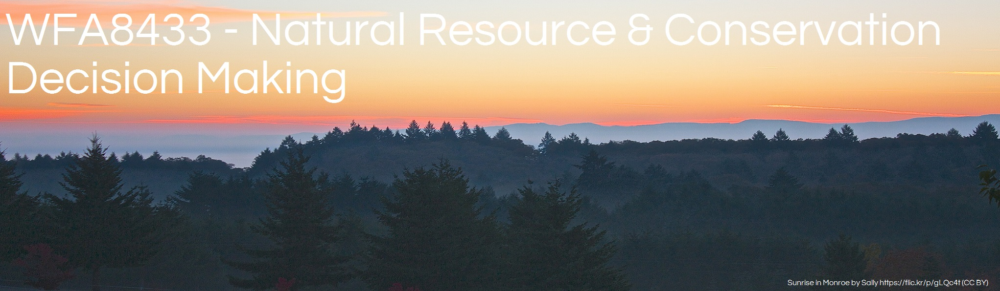

```{r echo=FALSE, out.width="95%"}

```

# Introduction to decision making


<!--source progress code-->
```{r child='/Module-01/01-01-Frontmatter.Rmd', eval=TRUE}
``` 


<!--source progress code-->
```{r child='in-progress.Rmd', eval=TRUE}
``` 

<!--
hare Rmd fragments you should name them with a leading underscore (_) 
then include them within their parent Rmd document using the child chunk option
run as a child with a deck and narrative...
## For next class
get content from archive.
using img source was messing shit up use knitr include 
-->


