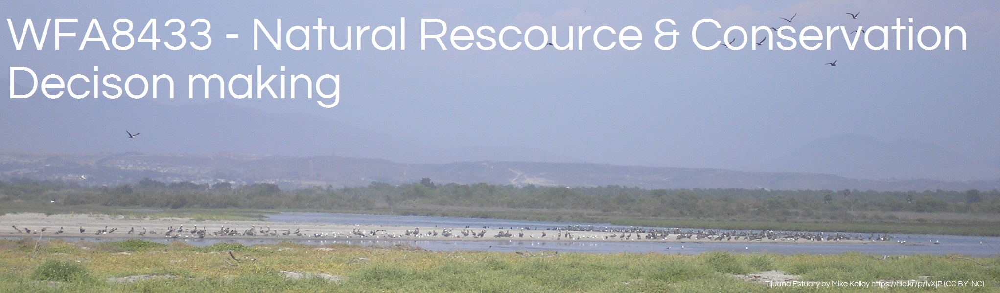

```{r echo=FALSE, out.width="95%"}

```
<!--

library(knitr)
rmarkdown::render_site("R-tutorials.Rmd")# build website
# COPY FILES TO DOCS FOR GITHUB.IO
system(paste("xcopy", 
    '"C:/Users/mcolvin/Documents/Teaching/WFA8433-Natural-Resource-Decision-Making/Course-Materials/_site"', 
    '"C:/Users/mcolvin/Documents/Teaching/WFA8433-Natural-Resource-Decision-Making/Docs"',
    "/E /C /H /R /K /O /Y")) 
  q(save="no")  

-->

# WFA8433 - R tutorials and resources
A great course on R for Fish and Wildlife Grads put together by folks at 
 Oregon State University.
It is 20 or so pages on relevant bits of R and other useful information
 (e.g., databases) geared toward new R users. 
 
* [R for Fish and Wildlife Grad](https://sites.google.com/site/rforfishandwildlifegrads/)

Here are some nice YouTube video tutorials about using R from the folks at Google.

* [R 1.1 - Initial Setup and Navigation](https://youtu.be/iffR3fWv4xw)
* [R 1.2 - Calculations and Variables](https://youtu.be/S-o-sdlzhkE?list=PLOU2XLYxmsIK9qQfztXeybpHvru-TrqAP)
* [R 1.3 - Create and Work With Vectors](https://youtu.be/YhQOV27pQfg?list=PLOU2XLYxmsIK9qQfztXeybpHvru-TrqAP)
* [R 1.4 - Character and Boolean Vectors](https://youtu.be/GKu5tw_bIpA?list=PLOU2XLYxmsIK9qQfztXeybpHvru-TrqAP)
* [R 1.5 - Vector Arithmetic](https://youtu.be/u5hroyx0J4o?list=PLOU2XLYxmsIK9qQfztXeybpHvru-TrqAP)
* [R 1.6 - Building and Subsetting Matrices](https://youtu.be/cR-hEUs1rRw?list=PLOU2XLYxmsIK9qQfztXeybpHvru-TrqAP)
* [R 1.7 - Section 1 Review and Help Files](https://youtu.be/mtu5_IYhgpg?list=PLOU2XLYxmsIK9qQfztXeybpHvru-TrqAP)
* [R 2.1 - Loading Data and Working With Data Frames](https://youtu.be/qK1ElUMkhq0?list=PLOU2XLYxmsIK9qQfztXeybpHvru-TrqAP)
* [R 2.2 - Loading Data, Object Summaries, and Dates](https://youtu.be/cx_3zWo4sUs?list=PLOU2XLYxmsIK9qQfztXeybpHvru-TrqAP)
* [R 2.3 - if Statements, Logical Operators, and the which Function]()
* [R 2.4 - for Loops and Handling Missing Observations](https://youtu.be/djI-yfk-DZM?list=PLOU2XLYxmsIK9qQfztXeybpHvru-TrqAP)
* [R 2.5 - Lists](https://youtu.be/UffunYeERV0?list=PLOU2XLYxmsIK9qQfztXeybpHvru-TrqAP)
* [R 3.1 - Managing the Workspace and Variable Casting](https://youtu.be/8oc3mIa0TCw?list=PLOU2XLYxmsIK9qQfztXeybpHvru-TrqAP)
* [R 3.2 - The apply Family of Functions](https://youtu.be/WuCVs3bW-ZY?list=PLOU2XLYxmsIK9qQfztXeybpHvru-TrqAP)
* [R 3.3 - Access or Create Columns in Data Frames, or Simplify a Data Frame using aggregate](https://youtu.be/pZ6Bnxg9E8w?list=PLOU2XLYxmsIK9qQfztXeybpHvru-TrqAP)
* [R 4.1 - Basic Structure of a Function](https://youtu.be/Z1wB1rHAYzQ?list=PLOU2XLYxmsIK9qQfztXeybpHvru-TrqAP)
* [R 4.2 - Returning a List and Providing Default Arguments](https://youtu.be/DzIy6U-N6ac?list=PLOU2XLYxmsIK9qQfztXeybpHvru-TrqAP)
* [R 4.3 - Add a Warning or Stop the Function Execution](https://youtu.be/29TdKkUmcA4?list=PLOU2XLYxmsIK9qQfztXeybpHvru-TrqAP)
* [R 4.4 - Passing Additional Arguments Using an Ellipsis](https://youtu.be/O3Bf2hM_gNc?list=PLOU2XLYxmsIK9qQfztXeybpHvru-TrqAP)
* [R 4.5 - Make a Returned Result Invisible and Build Recursive Functions](https://youtu.be/CHmmHfJ8hCA?list=PLOU2XLYxmsIK9qQfztXeybpHvru-TrqAP)
* [R 4.6 - Custom Functions With apply](https://youtu.be/H06_Ic_kDvI?list=PLOU2XLYxmsIK9qQfztXeybpHvru-TrqAP)


