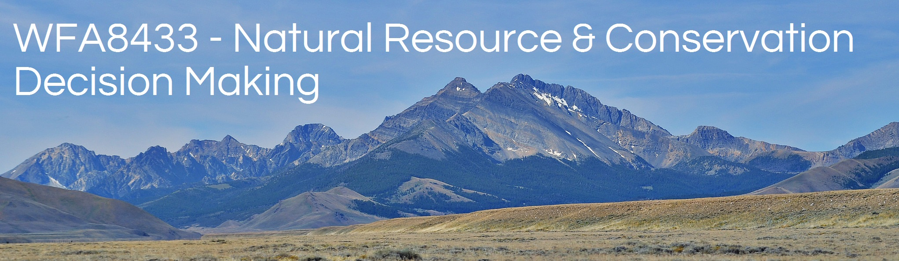

```{r echo=FALSE, out.width="95%"}

```
<!--

library(knitr)
rmarkdown::render_site()# build website

# rmarkdown::render_site("index.Rmd")# build webpage
# COPY FILES TO DOCS FOR GITHUB.IO
system(paste("xcopy", 
    '"C:/Users/mcolvin/Documents/Teaching/WFA8433-Natural-Resource-Decision-Making/Course-Materials/_site"', 
    '"C:/Users/mcolvin/Documents/Teaching/WFA8433-Natural-Resource-Decision-Making//Docs"',
    "/E /C /H /R /K /O /Y")) 
  q(save="no")  

-->

## Announcements

* Deck and recording from Class 3 is posted. Click [here](Class-03.html) 20170118
* Deck from Class 1 and 2 are posted. Click [here](Class-01.html) for class 1 and [here](Class-02.html) for class 2 20170113
* Welcome to WFA8433 Natural Resource And Conservation Decision Making! 200170111