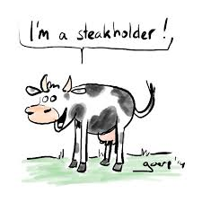

# Housekeeping

## For next class
Reading for next class: Hammond et al.: Chapters(s) 1-3

## Syllabus overview

link to syllabus....

## Class objectives

1. Kick ass
2. Take names

```{r,echo=FALSE}
plot(runif(10))
```


# Why is decision making important

## Managing public trust resources

- Eat spaghetti
- Drink wine

## Using public funds
- Nat Geo costs example...

## Stakeholders are watching



## Stakeholders are interested


## Example: Pallid Sturgeon in the Missouri River
- Pallid Sturgeon recover is expected to cost 700 million USD over the next 10 years

## Example: Least Terns and Piping Plovers
- Terns/plovers


## Slide 2 
```{r,echo=FALSE,fig.width=8,fig.height=4.5,dpi=300,out.width="1920px",height="1080px"}
plot(runif(10))
```


# How do we make decisions in natural resources?

## put an app in?

 <iframe src = 'https://mcolvin.shinyapps.io/pallid_sturgeon/' width='1920px' height='900px'></iframe>


