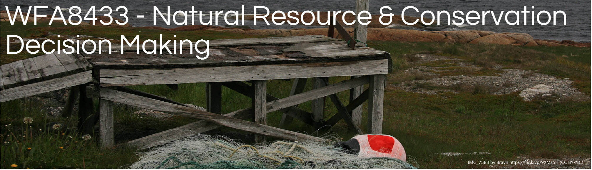

```{r echo=FALSE, out.width="100%"}

```
<!--

library(knitr)
rmarkdown::render_site("final-project.Rmd")# build webpage

# rmarkdown::render_site()# build webpage
# COPY FILES TO DOCS FOR GITHUB.IO
system(paste("xcopy", 
    '"C:/Users/mcolvin/Documents/Teaching/WFA8433-Natural-Resource-Decision-Making/Course-Materials/_site"', 
    '"C:/Users/mcolvin/Documents/Teaching/WFA8433-Natural-Resource-Decision-Making/Docs"',
    "/E /C /H /R /K /O /Y")) 
  q(save="no")  

-->

# Final project information

*Recall that the final report and presentation
will be due during the final exam period*


```{r,echo=FALSE, out.align="center",out.width="100%",eval=FALSE}
## Timeline
library(timevis)
dat<- read.csv("./Course-Information/final-project-timeline.csv")
config <- list(
    editable = TRUE,
    margin = list(item = 30, axis = 50)
    )
timevis(dat, zoomFactor = 1, options = config)
```


## Final report sections

The bullets below represent
the major and minor elements
expected in the final report.


* MANAGEMENT PROBLEM
    * Spatial and temporal dimensions
    * Legal, regulatory, and institutional constraints
* STAKEHOLDERS
* OBJECTIVES
* DECISION ALTERNATIVES
* VALUATION OF OUTCOMES
* DECISION MODEL OVERVIEW
    * Nodes-Description of decision model nodes and states
    * Sensitivity analysis
    * Ecological context
* DISCUSSION
    * Value of the process
    * Future steps and lessons learned

    
## Examples

The pdfs below provide an example of the 
final report and presentation.

* [Example final presentation](pdfs/mussel-example-presentation.pdf)
* [Example final report](pdfs/mussel-example-report.pdf)
    
    